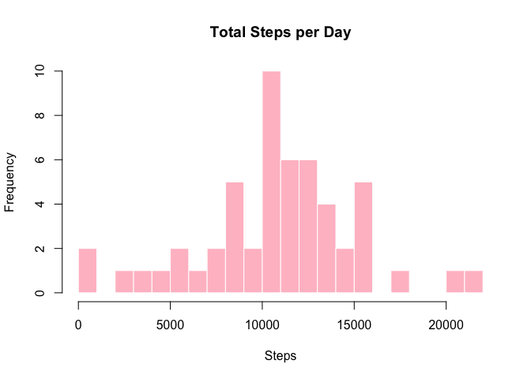
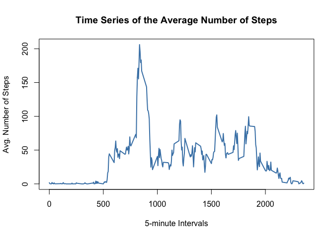
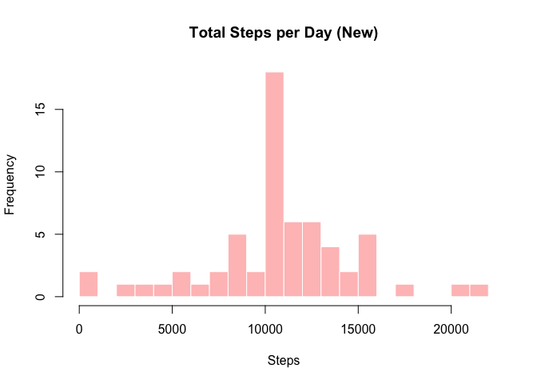
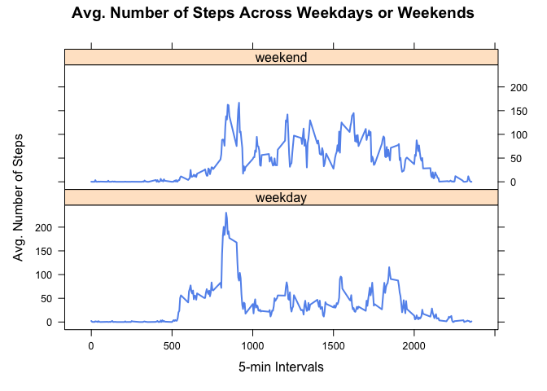

# Introduction
It is now possible to collect a large amount of data about personal movement using activity monitoring devices such as a [Fitbit](http://www.fitbit.com/), [Nike Fuelband](http://www.nike.com/us/en_us/c/nikeplus-fuelband), or [Jawbone Up](https://jawbone.com/up). These type of devices are part of the “quantified self” movement – a group of enthusiasts who take measurements about themselves regularly to improve their health, to find patterns in their behavior, or because they are tech geeks. But these data remain under-utilized both because the raw data are hard to obtain and there is a lack of statistical methods and software for processing and interpreting the data.

This assignment makes use of data from a personal activity monitoring device. This device collects data at 5 minute intervals through out the day. The data consists of two months of data from an anonymous individual collected during the months of October and November, 2012 and include the number of steps taken in 5 minute intervals each day.

# Data

The data for this assignment can be downloaded from the course web site:

* Dataset: [Activity monitoring data](https://d396qusza40orc.cloudfront.net/repdata%2Fdata%2Factivity.zip) 

The variables included in this dataset are:

* steps: Number of steps taking in a 5-minute interval (missing values are coded as 𝙽𝙰) </br>
* date: The date on which the measurement was taken in YYYY-MM-DD format </br>
* interval: Identifier for the 5-minute interval in which measurement was taken </br>
The dataset is stored in a comma-separated-value (CSV) file and there are a total of 17,568 observations in this dataset. 

# Loading and preprocessing the data
Show any code that is needed to  
  **1. Load the data (i.e. read.csv())**


```r
library(data.table)
library(ggplot2)
library(dplyr)
library(lattice)
```


```r
#load the data
Activity <- read.csv("activity.csv")

#check the data
head(Activity)
```

```
##   steps       date interval
## 1    NA 2012-10-01        0
## 2    NA 2012-10-01        5
## 3    NA 2012-10-01       10
## 4    NA 2012-10-01       15
## 5    NA 2012-10-01       20
## 6    NA 2012-10-01       25
```

```r
str(Activity)
```

```
## 'data.frame':	17568 obs. of  3 variables:
##  $ steps   : int  NA NA NA NA NA NA NA NA NA NA ...
##  $ date    : chr  "2012-10-01" "2012-10-01" "2012-10-01" "2012-10-01" ...
##  $ interval: int  0 5 10 15 20 25 30 35 40 45 ...
```

  **2. Process/transform the data (if necessary) into a format suitable for 
  your analysis.**  


```r
#Change the date from class factor to class date
Activity$date <- as.Date(Activity$date, format = "%Y-%m-%d")
```

# What is mean total number of steps taken per day?
For this part of the assignment, you can ignore the missing values in the dataset.   
  **1. Calculate the total number of steps taken per day.**

```r
#Calculating the total number of steps per day and storing it in a variable called "TotalSteps"
TotalSteps <- aggregate(steps ~ date, data = Activity, sum, na.rm = TRUE)
summary(TotalSteps)
```

```
##       date                steps      
##  Min.   :2012-10-02   Min.   :   41  
##  1st Qu.:2012-10-16   1st Qu.: 8841  
##  Median :2012-10-29   Median :10765  
##  Mean   :2012-10-30   Mean   :10766  
##  3rd Qu.:2012-11-16   3rd Qu.:13294  
##  Max.   :2012-11-29   Max.   :21194
```

```r
head(TotalSteps)
```

```
##         date steps
## 1 2012-10-02   126
## 2 2012-10-03 11352
## 3 2012-10-04 12116
## 4 2012-10-05 13294
## 5 2012-10-06 15420
## 6 2012-10-07 11015
```

  **2. If you do not understand the difference between a histogram and a barplot,
  research the difference between them. Make a histogram of the total number of
  steps taken each day.** 


```r
#Making a histogram of the total number of steps using base plotting system
hist(TotalSteps$steps, 
     breaks = 20, 
     main = "Total Steps per Day", 
     xlab = "Steps", 
     col = "pink", 
     border = "white")
```

<!-- -->

  **3. Calculate and report the mean and median of the total number of steps taken per day.**

```r
#Calculating the mean and median of the total number of steps per day
mean(TotalSteps$steps, na.rm = TRUE)
```

```
## [1] 10766.19
```

```r
median(TotalSteps$steps, na.rm = TRUE)
```

```
## [1] 10765
```

# What is the average daily activity pattern?
  **1. Make a time series plot (i.e. type= "l") of the 5-minute interval (x-axis) and the average number of steps taken, averaged across all days (y-axis).**


```r
#Averaging the steps per interval and storing it in a variable called "AvgActivity"
AvgActivity <- aggregate(steps ~ interval, data = Activity, mean, na.rm = TRUE)
head(AvgActivity)
```

```
##   interval     steps
## 1        0 1.7169811
## 2        5 0.3396226
## 3       10 0.1320755
## 4       15 0.1509434
## 5       20 0.0754717
## 6       25 2.0943396
```

```r
#Creating the time series plot 
plot(AvgActivity$interval, AvgActivity$steps, type = "l", lwd = 2,
     col = "steelblue",
     main = "Time Series of the Average Number of Steps",
     xlab = "5-minute Intervals",
     ylab = "Avg. Number of Steps")
```

<!-- -->

  **2. Which 5-minute interval, on average across all the days in the dataset, contains the maximum number of steps?**
  

```r
AvgActivity$interval[which.max(AvgActivity$steps)]
```

```
## [1] 835
```


# Imputing missing values   
Note that there are a number of days/intervals where there are missing values (coded at NA). The presence of missing days may introduce bias into some calculations or summaries of the data.   

  **1. Calculate and report the total number of missing values in the dataset (i.e. the total number of rows)**

```r
sum(is.na(Activity))
```

```
## [1] 2304
```

There are 2304 missing values in the dataset. 

  **2. Devise a strategy for filling in all of the missing values in the dataset. The strategy does not need to be sophisticated. For example, you could use the mean/median for that day, or the mean for that 5-minute interval, etc.** 

I will be using the mean of 5-minute interval to fill in the missing values. 


```r
#Replacing NA values with mean in 5-min interval 
AvgSteps <- aggregate(steps ~ interval, data = Activity, mean)
replaceNA <- numeric()
  for (i in 1:nrow(Activity)) {
    acti <- Activity[i, ]
    if (is.na(acti$steps)) {
        steps <- subset(AvgSteps, interval == acti$interval)$steps
    } else {
        steps <- acti$steps
    }
    replaceNA <- c(replaceNA, steps)
  }
```

  **3. Crate a new dataset that is equal to the original dataset but with the missing data filled in.** 

```r
#Creating a new dataset with no NA values
Activity2 <- Activity
Activity2$steps <- replaceNA

#Checking if there are no NA values
sum(is.na(Activity2))
```

```
## [1] 0
```

  **4. Make a histogram of the total number of steps taken each day and calculate and report the mean and the median total number of steps taken per day. Do these values differ from the estimates from the first part of the assignment? What is the impact of imputing missing data on the estimates of the total daily number of steps?** 


```r
#Making a histogram of the total number of steps each day with new dataset
TotalSteps2 <- aggregate(steps ~ date, data = Activity2, sum, na.rm = TRUE)
hist(TotalSteps2$steps, 
     breaks = 20, 
     main = "Total Steps per Day (New)", 
     xlab = "Steps", 
     col = "rosybrown1", 
     border = "white")
```

<!-- -->

```r
#Calculating mean and median using the new dataset
mean(TotalSteps2$steps)
```

```
## [1] 10766.19
```

```r
median(TotalSteps2$steps)
```

```
## [1] 10766.19
```

The mean is equivalent to the mean from the first part of the assignment. However, the median is different, albeit their values are close. Using the average of 5-minute intervals to imput missing data results in more data points equal to the mean and smaller variation of the distribution. As many data points are equal to the mean, the median is more likely to be the same as the mean as well. 

# Are there differences in activity patterns between weekdays and weekends?   
For this part the weekdays() function may be of some help here. Use the dataset with the filled-in missing values for this part.   

  **1. Create a new factor variable in the dataset with two levels - "weekday" and "weekend" indicating whether a given date is a weekday or a weekend day.** 


```r
#Creating a new factor variable with 2 levels "weekday" and "weekend" 
Activity2$date <- as.Date(Activity2$date, "%Y-%m-%d")
Activity2$day <- weekdays(Activity2$date)
Activity2$week <- ""
Activity2[Activity2$day == "Saturday" | Activity2$day == "Sunday", ]$week <- "weekend"
Activity2[!(Activity2$day == "Saturday" | Activity2$day == "Sunday"), ]$week <- "weekday"
Activity2$week <- factor(Activity2$week)
```

  **2. Make a panel plot containing a time series plot (i.e., type = "l") of the 5-minute interval (x-axis) and the average number of steps taken, averages across all weekday days or weekend days (y-axis). See the README file in the GitHub repo to see an example of what this plot should look like using simulated data.** 


```r
#Calculating the average number of steps taken across weekdays or weekend days
AvgSteps2 <- aggregate(steps ~ interval + week, data = Activity2, mean)

#Making a panel plot 
xyplot(steps ~ interval | week, data = AvgSteps2, type = "l", lwd = 2,
       layout = c(1,2),
       xlab = "5-min Intervals",
       ylab = "Avg. Number of Steps",
       main = "Avg. Number of Steps Across Weekdays or Weekends",
       col = "cornflowerblue")
```

<!-- -->
